# DISMATH_ProjectBonus_biancamille
Linear and Binary Search, including Bubble Sort

## Screen 1
- Designer
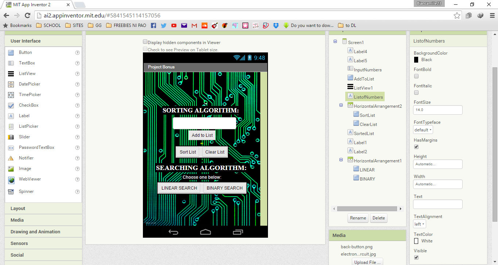
- Blocks
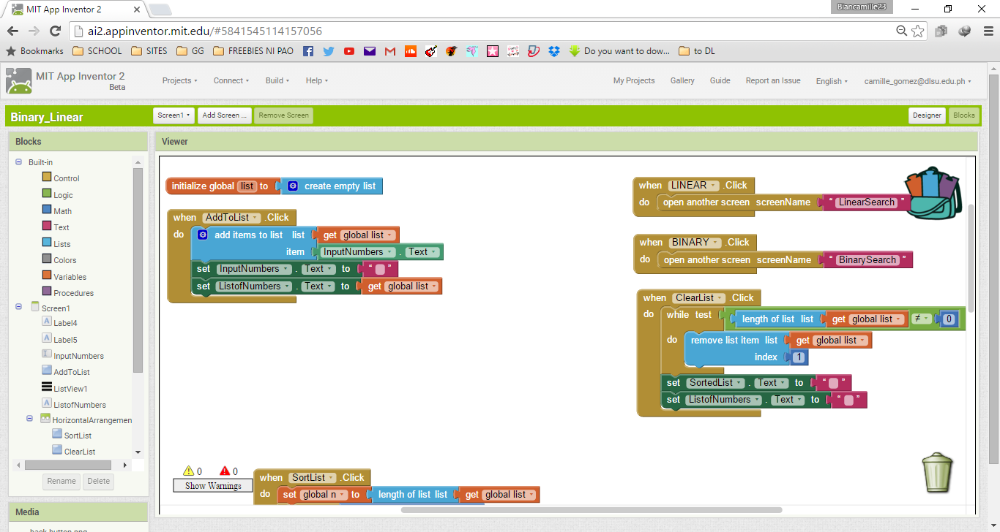

## Linear Search
- Designer
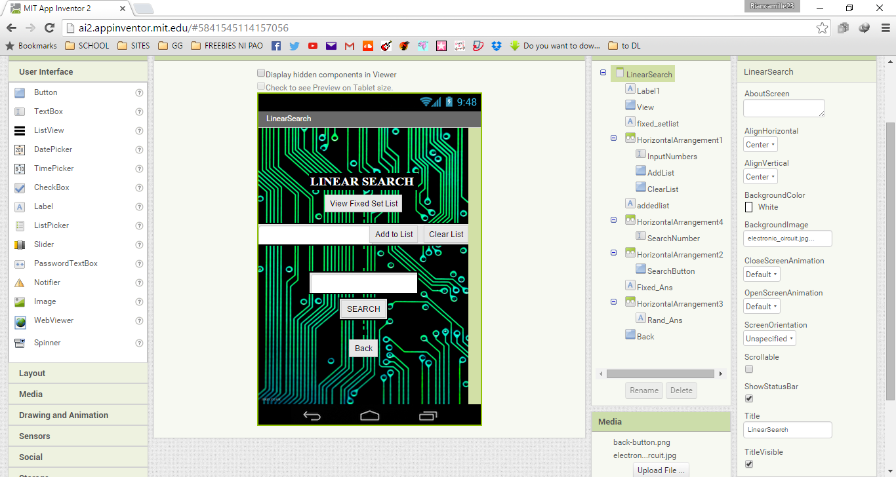
- Blocks
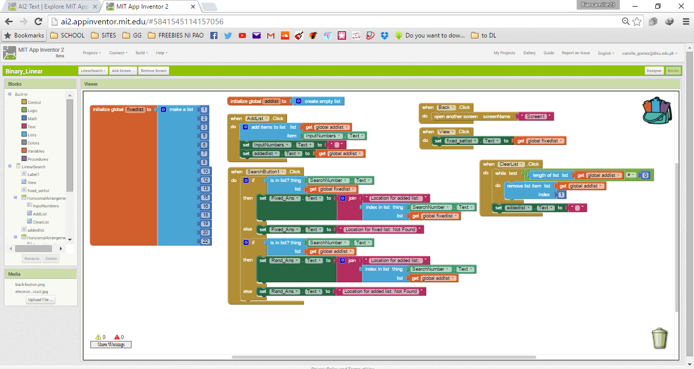

## Binary Search
- Designer
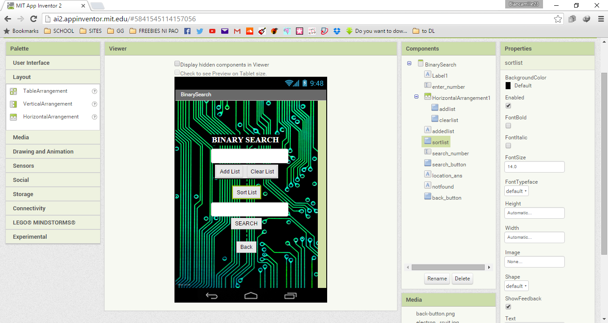
- Blocks
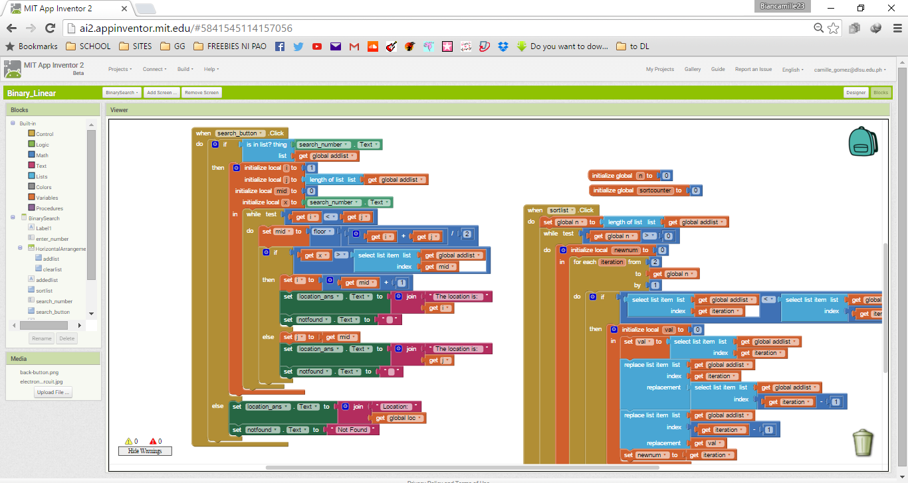

## Bubble Sort
- Blocks
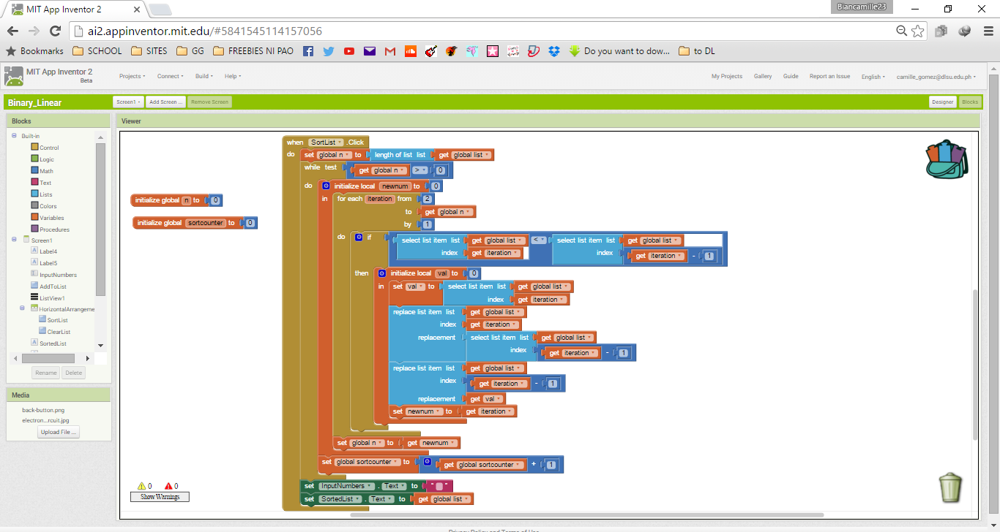

## Android 
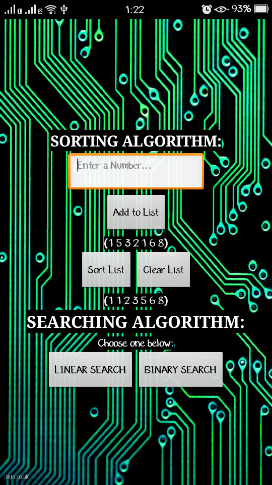

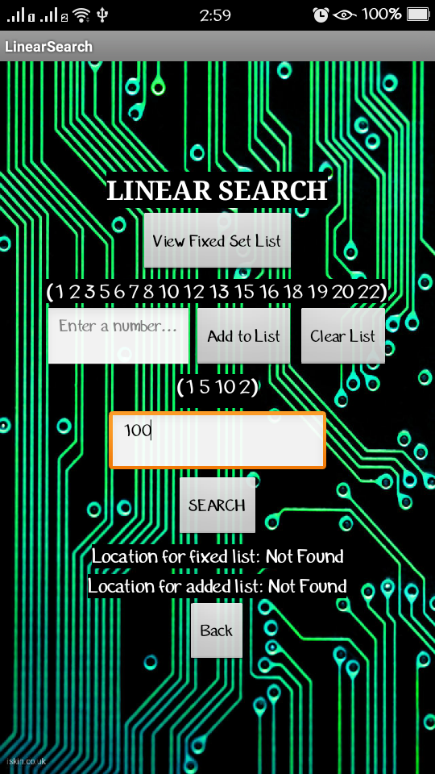

- Not sorted
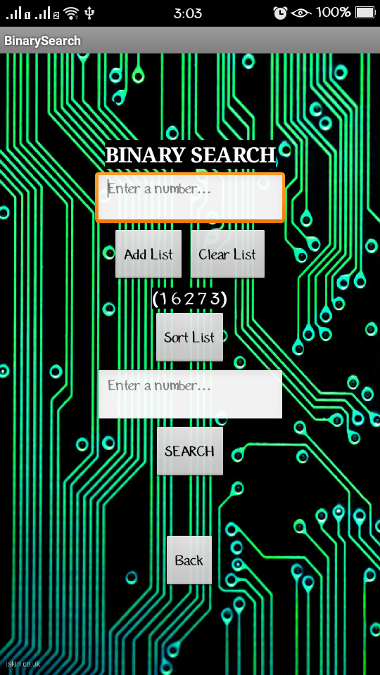

- Sorted

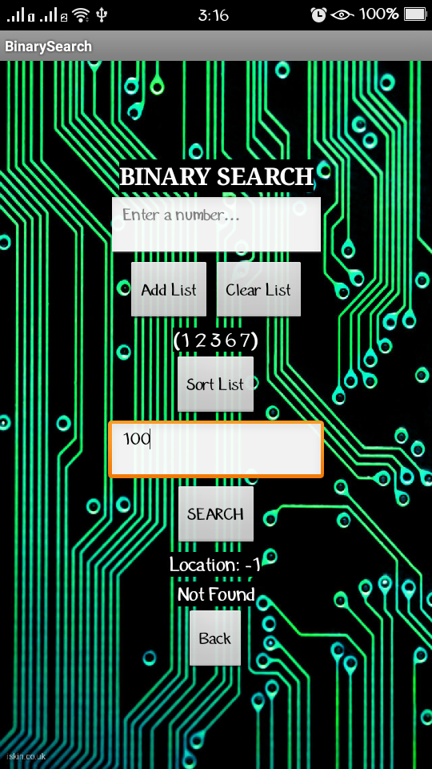
